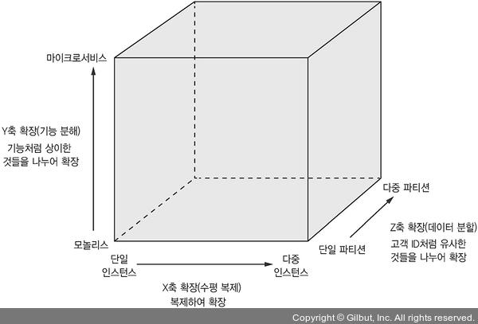

# [1장] 모놀리식 지옥에서 벗어나라

## 🔹 모놀리식 아키텍처
규모와 복잡도가 커지면서 장점은 곧 단점이 된다!
| 작은 규모일 때 => 장점 | 큰 규모 일 때 => 단점                                                 |
| ---------------------- | --------------------------------------------------------------------- |
| 간단한 개발            | 코드베이스를 이해하기 힘들어서 개발이 어렵다.                         |
| 쉬운 변경              | 이해할 수 없으니 변경분을 정확히 반영할 수 없다.                      |
| 쉬운 테스트            | 애플리케이션이 커져서 철저히 테스트하기 힘들고, 신뢰성이 부족해진다.  |
| 쉬운 배포              | 애플리케이션이 커져서 빌드, 배포 시간이 오래 걸린다.                  |
| 쉬운 확장              | 모듈마다 리소스 요건(CPU bound, I/O bound) 이 달라서 확장하기 어렵다. |

## 🔹 확장 큐브 : 애플리케이션을 확장하는 3가지 방법

- 수평 복제 : 로드밸런서 → 가용성
- 데이터 분할 : 라우터 → 데이터 볼륨 처리
- 기능 분해 : 마이크로서비스 → 복잡성

## 🔹 마이크로서비스 아키텍처

## ✅ 개념

- 하나의 애플리케이션을 여러 서비스로 기능 분해하는 아키텍처
- 각 서비스가 집중된(focused)/응집된(cohesive) 책임을 맡고 있음 → 모듈성
- REST, gRPC 처럼 가벼운 프로토콜을 이용한 메시지 브로커, 서비스 간 통신 중심의 덤 파이프로 서비스 통신함
- 장점 👍
    - 크고 복잡한 애플리케이션을 지속적으로 전달/배포 가능
    - 관리가 용이
    - 서비스를 독립적으로 배포/확장 가능
    - 결함 격리가 잘 됨
    - 신기술을 시험/도입하기 쉬움
- 단점 👎
    - 딱 맞는 서비스를 찾기 쉽지 않음 → 잘못 분해 시, 모놀리식과 마이크로서비스의 단점들만 가짐 (최악...)
    - 분산 시스템은 매우 복잡함 → 다중 DB 조회, 데이터 일관성, 운영 복잡성 ...
    - 여러 서비스에 걸친 공통 기능은 배포할 때 주의해야 함
    - 도입 시기를 결정하기 어려움

> 모든 기술은 "trade-off"가 있다!
마이크로서비스 아키텍처도 마찬가지다.
감정을 배제하고, 이 아키텍처의 장점과 단점을 살펴보고 상황에 맞게 도입하자.

## ✅ 패턴 언어

- 특정 영역 내부에서 문제를 해결하는 연관된 패턴의 집합
- 패턴의 구조
    - 강제 조항 : 처리해야될 이슈
    - 결과 맥락 : 패턴 적용 결과
    - 연관 패턴 : 선행자 / 후행자 / 대안 / 일반화 / 세분화
- MSA 패턴 언어
    - 애플리케이션을 여러 서비스로 분해하는 패턴
    - 통신 패턴 : IPC
    - 트랜잭션 관리를 위한 데이터 일관성 패턴
    - 데이터 쿼리 패턴
    - 서비스 배포 패턴
    - 관측성 패턴
    - 서비스 테스트 자동화 패턴
    - 횡단 관심사 처리 패턴
    - 보안 패턴

## ✅ 프로세스와 조직

MSA의 도입은 프로세스, 조직, 인간적 요소에 큰 영향을 끼친다!  

- 거대한 한 팀이 작은 여러팀으로 나눠짐
    1) 소통 오버헤드가 줄어듦 
    2) 움직임이 훨씬 빨라짐
    3) 조직 확장성이 좋아짐 (서로 느슨한 결합)
- 애자일 프로세스
- 지속적 전달/배포 (CI/CD)
- 팀원들의 감정 변화