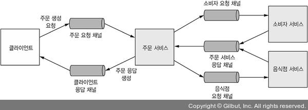

# 3장 : 프로세스 간 통신

## 1. MSA의 IPC 개요

### 🔹 상호작용
- IPC를 선택하기 전, **클라이언트/서비스 간 상호작용 스타일**을 잘 선택해야 한다.
    - 상호작용 스타일은 전체 애플리케이션의 가용성, 통합 테스트 전략 수립에 영향을 끼친다.
    

### 🔹 API
- 정의 : API는 IDL(Interface Definitino Language)로 정확하게 정의하고, 구현해야 한다.
- 변경 : 작은 변경에서는 하위 호환성을 고려하여 변경하고, 기존과 호환할 수 없는 중대한 변경은 일정 기간 동안 신/구 버전을 모두 지원해야 한다.
    - API 버저닝
        - REST API : url 경로에 엘리먼트
        - 메시징 기반 서비스 : 메시지에 버전 번호

### 🔹 데이터 포맷
1) 텍스트 데이터 포맷 : JSON, XML
   - 하위 호환성이 쉽게 보장되나 메시지가 다소 길어서 속성명, 데이터 파싱 등의 오버헤드 존재
2) 이진 데이터 포맷 : 프로토콜 버퍼, 아브로

# 2. 동기 RPI 패턴 응용 통신

## 🔹 RPI

- 클라이언트가 서비스에 요청을 보내면 서비스가 처리 후 응답을 회신하는 IPC
- 블로킹/논블로킹 둘다 가능 → 응답이 제때 도착할 것을 가정

## 🔹 동기 RPI 패턴 : REST
- HTTP 로 소통하는 IPC
- HTTP 동사(`GET`, `POST`, `PUT` 등) 를 사용해서 URL 로 참조는되는 리소스를 가공한다
- IDL : 스웨거
- 장점
    - 단순하고 익숙
    - 포스트맨(Postman) 같은 브라우저 플러그인이나 curl 등의 CLI 도구를 사용해서 HTTP API를 간편하게 테스트
    - 요청/응답 스타일의 통신을 직접 지원
    - HTTP는 방화벽 친화적
    - 중간 브로커가 필요하지 않기 때문에 시스템 아키텍처가 단순
- 단점
    - 요청/응답 스타일의 통신만 지원
    - 가용성이 떨어짐 (중간에서 메시지를 버퍼링하는 매개자 없이 클라이언트/서비스가 직접 통신하기 때문에 교환이 일어나는 동안 양쪽 다 실행 중이어야 함)
    - 서비스 인스턴스(들)의 위치(URL)를 클라이언트가 알고 있어야 함
    - 요청 한번으로 많은 리소스를 가져오기 어려움 → API 대체기술 : `GraphQL`, `Netflix Falcor`
    - 작업을 HTTP 동사에 매핑하기 어려움 → REST 대체 기술 : `gRPC`

## 🔹 동기 RPI 패턴 : gRPC
- 다양한 언어로 클라이언트/서버를 작성할 수 있는 프레임워크
- 이진 메시지 기반의 프로토콜
- IDL : 프로토콜 버퍼

## 🔹 부분 실패 처리 : 서킷 브레이커 (circuit breaker)
- 배경
    - 분산 시스템은 동기 호출로 부분 실패할 가능성이 항상 있다.
    - 클라이언트는 응답 대기 도중 블로킹되기 때문에 ✖ 전체 시스템의 중단 ✖ 을 초래할 수 있다!
- 서킷 브레이커
    - 연속 실패 횟수가 주어진 임계치를 초과하면, 일정 시간 동안 호출을 거부하는 RPI 프록시
- 해결방법
    1) 견고한 RPI 프록시 설계 : `Hystrix`, `Polly`
    - 네트워크 타임아웃
    - 미처리 요청 개수 제한 : 클라이언트가 특정 서비스에 요청 가능한 미처리 요청 최대 개수를 설정
    - 서킷 브레이커 : 연속 실패 횟수가 주어진 임계치를 초과하면, 일정 시간 동안 호출을 거부 → 일정 시간 이후 성공하면 서킷 브레이커 닫힘
    2) 서비스 복구
    - 그때그때 상황에 맞게 판단 → 클라이언트는 각각 서비스가 실패할 경우에 대한 방안을 미리 준비
    - 기본 값, 대체 값(ex. 캐시된 응답)을 반환

## 🔹 디스커버리
- 배경
    - 서비스를 호출하려면, 서비스 인스턴스의 네트워크 위치(IP, 포트) 를 알아야 한다.
    - 클라우드 환경에서 네트워크 위치는 동적으로 할당된다.
- 개념
    - 서비스 레지스트리 : 서비스 인스턴스의 네트워크 위치를 DB화
- 구현 방식
    1) 애플리케이션 수준의 적용
       - 클라이언트/서비스가 직접 서비스 레지스트리와 상호작용
            (1) 자가 등록 패턴 : 레지스트리에 서비스 인스턴스가 직접 자신을 등록
            (2) 클라이언트 쪽 디스커버리 패턴 : 클라이언트는 레지스트리에 있는 가용 인스턴스 목록을 조회하고 부하 분산하여 요청을 전송 
       - 관련 기술 : `Eureka` , `Ribbon`, `Spring cloud`
       - 단점 : 언어에 맞는 서비스 디스커버리 라이브러리가 필요
    2) 플랫폼 내장 기능 사용 (권장되는 방식 👍)
       - 배포 인프라로 서비스 디스커버리를 처리
            (1) 서드파티 등록 패턴 : 배포 플랫폼의 등록기(registrar)라는 서드파티가 인스턴스를  레지스트리에 자동으로 등록
            (2) 서버 쪽 디스커버리 패턴 : 클라이언트가 DNS명을 요청하면, DNS 명은 가상 IP 주소로 해석 → 배포 플랫폼이 레지스트리에 있는 가용 인스턴스 목록을 조회하고 부하 분산하여 요청 전송
       - 특징 : 편리하지만, 해당 플랫폼으로 배포해야 함

# 3. 비동기 메시징 패턴 응용 통신
## 🔹 메시징
- 서비스가 메시지를 서로 비동기적으로 주고받는 통신 방식
- 논블로킹 → 응답을 받지 못할 것이라는 가정
- 요소
    - 메시지
        - 형식 : header / body
        - 종류 : 문서 / 커맨드 / 이벤트
    - 메시지 채널
        - 송진자 → 송신 포트 → 메시지 채널 → 메시지 핸들러 → 수신 포트 → 수신자
        - 종류 : 점대점 채널 (ex. 커맨드) / 발행-구독 채널 (ex. 이벤트)

## 🔹 메시징 상호 작용 스타일
- 요청/응답, 비동기 요청/응답
    - 요청 : 커맨드 메시지 (messageId, 응답채널 포함) → 점대점 채널
    - 응답 : 응답 메시지 (correlationId) → 응답 채널
- 단방향 알림
    - 커맨드 메시지 → 점대점 채널
    - 서비스가 채널 구독해서 메시지 처리
- 발행/구독
    - 도메인 이벤트 → 발행/구독 채널
    - 서비스는 관심있는 도메인 객체의 채널 구독
- 발행/비동기 응답
    - 요청/응답 + 발행/구독

## 🔹 메시지 브로커

- 브로커리스 아키텍처
    - 메시지를 직접 교환
    - 기술 :  `ZeroMQ`
    - 장점
        - 네트워크 트래픽이 가볍고 지연 시간이 짧음
        - 메시지 브로커가 성능 병목점이나 SPOF(Single Point Of Failure, 단일 장애점)가 될 일이 없음
        - 운영 복잡도가 낮음
    - 단점
        - 서비스가 서로의 위치를 알고 있어야 하므로 서비스 디스커버리 메커니즘 중 하나를 사용해야 함
        - 메시지 교환 시 송신자/수신자 모두 실행 중이어야 하므로 가용성이 떨어짐
        - 전달 보장 같은 메커니즘을 구현하기가 더 어려움

- 브로커 아키텍처
    - 송신자 → 메시지 브로커 → 수신자
    - 송신자가 컨슈머의 네트워크 위치를 몰라도 된다!
    - 브로커 선택 시 고려할 점
        - 프로그래밍 언어 지원 여부 / 메시징 표준 지원 여부 / 메시지 순서 / 전달 보장 / 영속화  / 내구성 / 확장성 / 지연 시간 / 경쟁사 컨슈머
    - 기술 : `ActiveMQ`, `RabbitMQ`, `Kafka`, `AWS Kinesis`, `AWS SQS`
        
    - 장점
        - 느슨한 결합 : 클라이언트는 그냥 메시지를 적절한 채널에 보내기만 하면 됨
        - 메시지 버퍼링 : 컨슈머가 처리할때까지 큐에 메시지가 쌓임
        - 유연한 통신 : 모든 상호작용 스타일을 지원
        - 명시적 IPC : 로컬 서비스인 것처럼 호출
    - 단점
        - 성능 병목 가능성
        - 단일 장애점 가능성
        - 운영 복잡도 증가

## 🔹 [이슈1] 수신자 경합 & 메시지 순서 유지
- 문제
    - 다수의 스레드, 인스턴스로 메시지를 동시 처리하려면, 메시지를 **한 번만 순서대로** 처리해야 한다
- 해결
    1. 채널 → 샤딩 (각 샤드는 채널처럼 작동)
    2. 송신자 → 메시지 헤더에 샤드 키
    메시지 브로커 → 메시지를 샤드 키별로 샤드/파티션에 배정
    3. 메시징 브로커는 여러 수신자 인스턴스를 묶어 관리하고, 각 샤드를 하나의 수신자에 배정

## 🔹 [이슈2] 중복 메시지 처리
- 문제
    - 클라이언트/네트워크/브로커에서 문제가 발생할 경우 같은 메시지를 여러 번 전달할 수도 있다
        - 주문생성(ACK 에러) → 주문취소
- 해결
    1. 멱등한 메시지 핸들러 작성
        - 반복 호출해도 부작용이 없는 경우 ex) 주문취소
    2. 메시지 추적과 중복 메시지 솎아내기
        - 컨슈머가 메시지를 처리할 때, DB에 메시지ID INSERT

## 🔹 [이슈3] 트랜잭셔널 메시징
- 문제
    - DB 업데이트 후 메시지가 전송되지 않은 상태에서 서비스가 중단될 수 있다.
- 해결
    - [DB업데이트 + 메시지 전송 = 1개의 트랜잭션] 으로 원자성 보장하기
    - transactional outbox 패턴 : DB 테이블(`OUTBOX`)을 임시 메시지 큐로 사용
        1. 메시지를 DB UPDATE 트랜잭션에 태워 `OUTBOX` 에 INSERT
        2. 메시지 릴레이는 `OUTBOX` 테이블의 메시지를 읽어서 브로커에 발행
    - 이벤트 발행
        (1) 폴링 패턴
        - 메시지 릴레이가 `OUTBOX` 에 있는 메시지를 가져옴 → 적절한 채널에 보냄  → 메시지 브로커에 발행 → `OUTBOX` 에 있는 메시지를 삭제
        - 규모가 작은 경우에 유용
        (2) 트랜잭션 로그 테일링 패턴  (권장되는 방식 👍)
        - 트랜잭션 로그 마이너가 `OUTBOX` 의 트랜잭션 로그를 읽음 → 로그를 메시지로 만듦 → 메시지 브로커에 발행
        - 기술 : 디비지움, 링크드인 데이터버스, DynamoDB 스트림즈, Eventuate Tram

# 4. 비동기 메시징으로 가용성 개선
- 동기 통신의 문제점
    - 클라이언트는 요청 후 응답을 기다려야 한다.
    - 요청을 처리하기 위해서 관련된 모든 서비스가 가동 중이어야 한다. ⇒ 가용성이 낮다!
- 동기 요청 없이 동기 요청 처리
    1. 비동기 상호 작용 (권장되는 방식 👍)
        - 동기 호출 대신 비동기 메시징을 통해서 서로 통신하면 가용성이 향상됨
        
    2. 데이터 복제
        - 데이터를 소유한 서비스가 발행하는 이벤트를 구독해서 레플리카를 최신으로 유지
        
    3. 응답 반환 후 마무리
        - 응답을 먼저 반환하고, 다른 서비스와 메시지를 교환하여 비동기적으로 검증