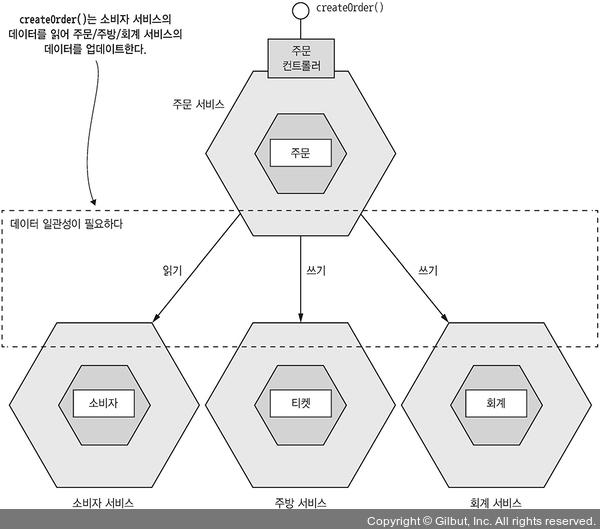
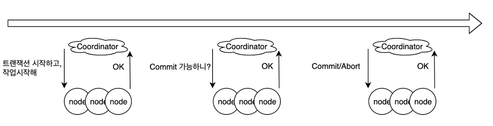
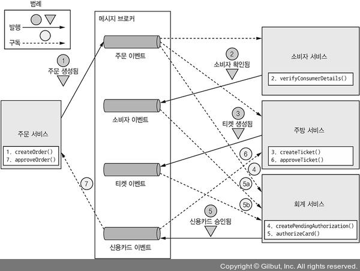
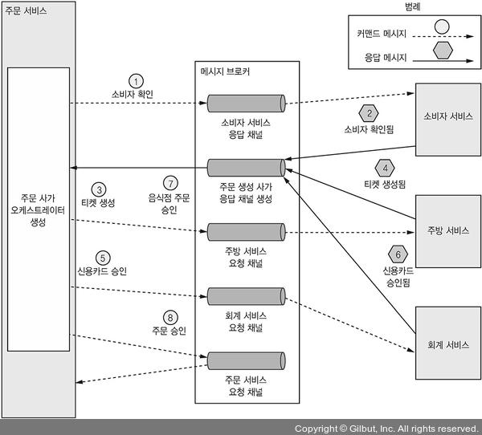
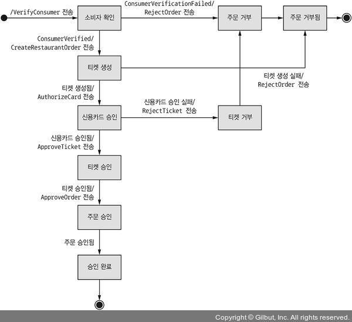

# [MSA] 4장 트랜잭션 관리: 사가

# 트랜잭션 관리

## ▪️트랜잭션

- 트랜잭션을 통해 데이터 일관성을 유지할 수 있다.
- 트랜잭션 특징 ACID
  - Atomicity 원자성
  - Consistency 일관성
  - Isolation 격리성
  - Durability 지속성

마이크로서비스 아키텍처에서 각 단일 서비스 내부의 트랜잭션은 ACID를 보장한다. 하지만, 여러 서비스의 데이터를 업데이트 해야하는 트랜잭션은 어떻게 구현할까?

## ▪️분산 트랜잭션

- 데이터 일관성을 유지하는 방법이다.
- X/Open DTP 모델(X/Open XA)이 표준이다.
- XA는 2단계 커밋을 이용하여 트랜잭션 참여자(서비스)가 반드시 커밋/롤백 하도록 보장한다.

## ▪️분산 트랜잭션 문제점

- 최신 기술 사용을 포기해야한다. 예) NoSQL DB, 메시지 브로커(RabbitMQ, 아파치 카프카)는 분산 트랜잭션 지원안함.
- 동기 IPC 라 가용성이 떨어진다. 분산 트랜잭션에 참여 중인 모든 서비스가 가동 중 이어야 한다.
- 요즘은 일관성 < **가용성**

‼️ 느슨하게 결합된 비동기 서비스 개념을 도입해보자.

## ▪️사가 패턴

- 분산 트랜잭션 없이 데이터 일관성을 유지하는 메커니즘이다.
- 사가는 일련의 **로컬 트랜잭션**이다. 어느 로컬 트랜잭션이 완료되면 이어서 다음 로컬 트랜잭션이 실행된다.
- 각 로컬 트랜잭션은 ACID 트랜잭션 프레임워크/라이브러리를 이용하여 서비스 별 데이터를 업데이트한다.
- 사가는 **비동기 메시징**을 이용한다. → 하나 이상의 사가 참여자(서비스)가 일시 불능 상태인 경우에도 사가의 전체 단계를 확실히 실행시킬 수 있다.

## ▪️사가 vs ACID 트랜잭션

- 사가는 **격리성**(I)가 없다.
- 사가는 로컬 트랜잭션마다 변경분을 커밋하므로 **보상 트랜잭션**을 걸어 롤백해야 한다.

# Saga Pattern

## 1. Choreography Saga

각 서비스(사가 참여자)가 서로 이벤트를 pub/sub 방식으로 통신한다.

### ▪️Flow

1. 주문 서비스: APPROVAL_PENDING 상태로 주문 생성(createOrder) → 주문 생성 이벤트 pub
2. 주문 생성 이벤트 sub
   - 소비자 서비스: 소비자가 주문을 할 수 있는지(verifyConsumerDetails) → 소비자 확인됨 이벤트 pub
   - 주방 서비스: 주문 내역 확인 → CREATE_PENDING 상태로 티켓을 생성(createTicket) → 티켓 생성됨 이벤트 pub
   - 회계 서비스: 신용 카드 승인을 PENDING 상태로 생성(createPendingAuthorization)
3. 회계 서비스: 소비자 확인됨 이벤트, 티켓 생성됨 이벤트 sub → 신용 카드 승인 → 카드 승인됨 이벤트 pub
4. 카드 승인됨 이벤트 sub
   - 주방 서비스: 티켓 상태를 AWAITING_ACCEPTANCE(approveTicket)
   - 주문 서비스: 주문 상태 APPROVED로 변경 → 주문 승인됨 이벤트 pub

**만약 소비자의 신용 카드가 승인 거부된다면?**

사가는 보상 트랜잭션을 가동하고 이전 작업을 취소해야 한다.

1. 동일
2. 동일
3. 회계 서비스: ... → 신용 카드 승인 → 거절 → 카드 승인 실패 이벤트 pub
4. 카드 승인 실패 이벤트 sub
   - 주방 서비스: 티켓 상태를 REJECTED로 변경
   - 주문 서비스: 주문 상태 REJECTED로 변경

### ▪️주의사항

- 서비스가 자신의 DB를 업데이트하고 DB 트랜잭션 일부로 이벤트 발행하도록 해야 한다. 이 작업은 원자적으로 일어나야 한다. → 해결책) 트랜잭셔널 메시징을 사용한다.
- 각 서비스는 구독한 이벤트와 자신이 가진 데이터를 연관 지을 수 있어야 한다. 예) 카드 승인됨 이벤트를 수신한 주문 서비스는 여기에 해당하는 주문을 찾을 수 있어야 한다. → 해결책) ID를 포함하여 이벤트를 발행

### ▪️장점

- 단순함: 객체 생성, 수정, 삭제 시 서비스가 이벤트 발행
- 느슨한 결합: 이벤트 구독만 할 뿐 각 서비스를 직접 알진 못함.

### ▪️단점

- 개발자가 이해하기 어렵다: 사가를 한 곳에 정의한게 아니니.
- 서로 이벤트를 구독하므로 서비스 간 순환 의존성(cycle-dependency)이 발생하기 쉽다. 예) 주문 → 회계 → 주문
- 단단히 결합될 위험성: 회계 서비스는 과금/환불 처리하게 만드는 모든 이벤트 구독해야 함. 다른 서비스와 의존성이 생김.

## 2. Orchestration Saga

- Orchestration class 정의하며, 이는 각 서비스가 해야할 일을 알려준다.
- 커맨드/비동기 응답 상호 작용을 하여 서비스와 통신한다.
- 오케스트레이터가 서비스에 커맨드 메시지를 보내면 서비스는 작업 완료 후 응답을 보낸다. 오케스트레이터는 응답 메시지를 처리하여 다음 단계를 수행할 서비스를 결정한다.

### ▪️Flow

1. 주문 서비스가 주문을 생성하고 사가 오케스트레이터를 생성한다.
2. 사가 오케스트레이터가 소비자 확인 커맨드를 소비자 서비스에 전송합니다.
3. 소비자 서비스는 소비자 확인 메시지를 응답합니다.
4. 사가 오케스트레이터는 티켓 생성 커맨드를 주방 서비스에 전송합니다.
5. 주방 서비스는 티켓 생성 메시지를 응답합니다.
6. 사가 오케스트레이터는 신용카드 승인 메시지를 회계 서비스에 전송합니다.
7. 회계 서비스는 신용카드 승인됨 메시지를 응답합니다.
8. 사가 오케스트레이터는 티켓 승인 커맨드를 주방 서비스에 전송합니다.
9. 사가 오케스트레이터는 주문 승인 커맨드를 주문 서비스에 전송합니다.

_사가 오케스트레이터는 주문 서비스의 컴포넌트라 직접 데이터를 업데이트 할 수 있지만 일관성 차원에서 9번 처럼 주문 서비스에게도 커맨드를 전송한다._

### ▪️사가 오케스트레이터 모델링

상태 머신은, 액션과 상태를 나눈 패턴이다.
행동을 인터페이스로 정의하여, 상태에 따라 행동들을 분류 시킨다.

**상태 머신**

- 상태와 이벤트에 의해 트리거 되는 상태 전이(transition)로 구성된다.
- 전이가 발생할 때마다 액션이 일어나며 액션은 각 서비스를 호출한다.

**모델링**

- 상태 머신으로 모델링 한다.
- 로컬 트랜잭션의 상태와 결과에 따라 상태 전이를 어떻게 하고 어떤 액션을 취할지 결정한다.
- 상태 간 전이는 서비스가 로컬 트랜잭션을 완료하는 시점에 트리거 된다.

### ▪️장점

- 의존 관계 단순화: 오케스트레이터는 서비스를 호출하지만 서비스는 오케스트레이터를 호출하지 않아서 순환 의존성 발생 안한다. 오케스트레이터만 참여자에게 의존.
- 낮은 결합도: 각 서비스는 오케스트레이터가 호출하는 API를 구현할 뿐 서비스가 발행하는 이벤트는 모름.
- 관심사를 더 분리하고 비즈니스 로직을 단순화: 사가 로직이 오케스트레이터에만 있어서 단순. 각 도메인 객체는 더 단순. 자신이 어떤 사가에 참여했는지 모름.

### ▪️단점

- 비즈니스 로직이 오케스트레이터에 너무 중앙화되면 오케스트레이터가 하나의 깡통 서비스에 일일이 할 일을 지시하는 모양새가 될 수 있다. → 순서화만 담당하고 비즈니스 로직을 갖지 않도록 설계하자.

# 비 격리 문제 처리

### ▪️격리성

- 동시에 실행 중인 여러 트랜잭션의 결과가 어떤 순서대로 실행되든 결과가 동일함을 보장한다는 걸 의미.
- 실행 중인 트랜잭션의 중간결과를 다른 트랜잭션이 접근할 수 없음.

### ‼️ 사가는 **격리성**이 없다.

- 한 사가가 실행 중에 접근하는 데이터를 다른 사가가 바꿔치기 할 수 있다.
- 한 사가가 업데이트를 하기 이전 데이터를 다른 사가가 읽을 수 있어서 데이터 일관성이 깨질 수 있다.

### ✅ 사가는 ACD 트랜잭션

- 원자성: 사가는 트랜잭션을 모두 완료하거나 모든 변경 분을 실행 취소 해야 한다.
- 일관성: 서비스 내부의 참조 무결성은 로컬 DB가, 여러 서비스에 걸친 참조 무결성은 서비스가 처리한다.
- 지속성: 로컬 DB가 처리한다.

## ▪️이슈

- 한 사가의 변경분을 다른 사가가 미처 못 읽고 덮어 쓴다.
- 사가 업데이트를 하지 않은 변경분을 다른 트랜잭션이나 사가가 읽는다.
- 한 사가의 상이한 두 단계가 같은 데이터를 읽어도 결과가 달라진다. 다른 사가가 그 사이에 업데이트를 했기 때문에 생긴다.

## ▪️대책

### 시맨틱 락

- 애플레케이션 수준의 락
- 보상 가능 트랜잭션이 생성/수정하는 레코드에 무조건 플래그를 세팅하는 대책
- PENDING

### 교환적 업데이트

업데이트 작업은 어떤 순서로 실행해도 되게끔 설계한다.

### 비관적 관점

사가 단계 순서를 재조정하여 비즈니스 리스크를 최소화한다.

### 값 다시 읽기

데이터를 덮어 쓸 때 그 전에 변경된 내용은 없는지 값을 다시 확인하여 더티 쓰기를 방지한다.

### 버전 파일

순서를 재조정할 수 있게 업데이트를 기록한다.

### 값에 의한

요청 별 비즈니스 위험성을 기준으로 동시성 메커니즘을 동적 선택한다.
