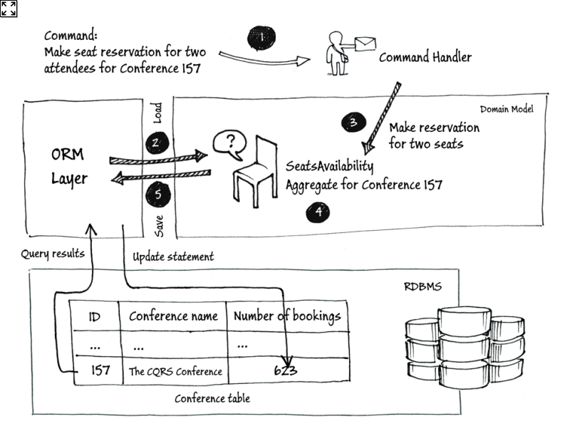
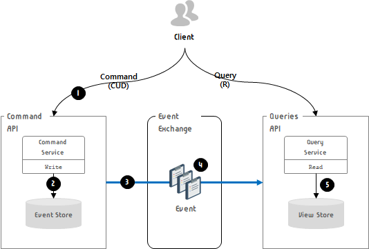
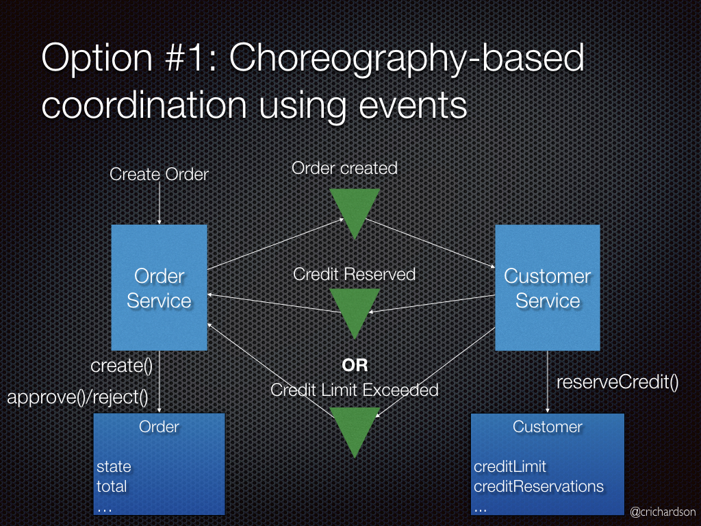
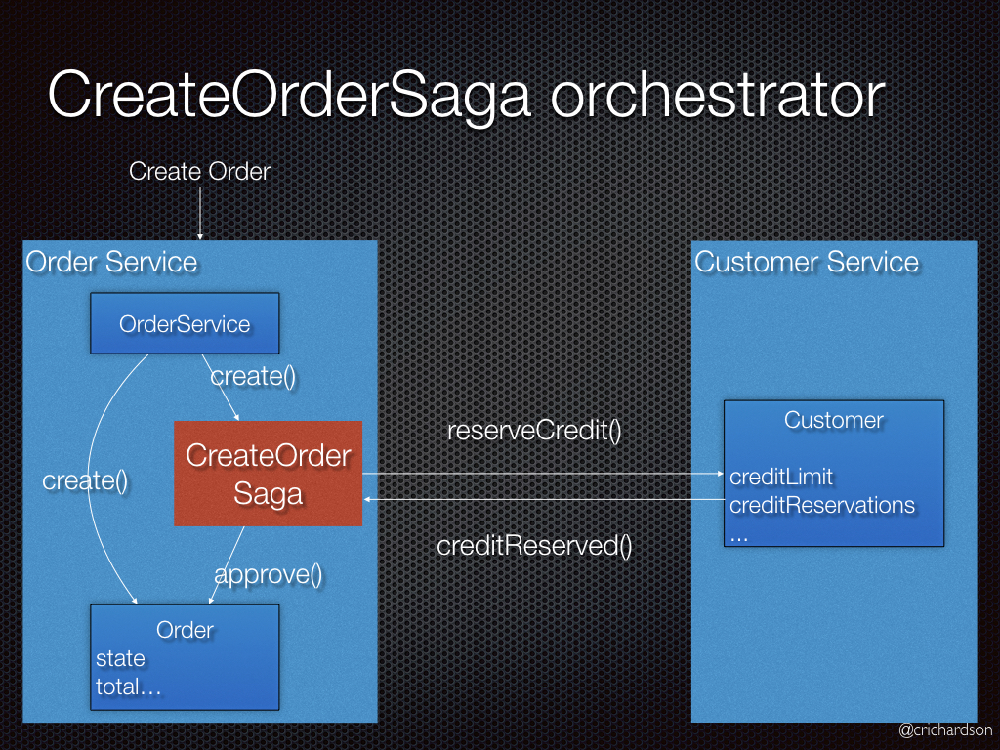

# 1 이벤트 소싱 응용 비즈니스 로직 개발

## 이벤트 소싱이란?
- 데이터 저장 방식 중 하나로 발생한 이벤트를 저장하는 기법. 
- 이벤트를 위주로 비즈니스 로직을 구현하고, 애그리거트를 DB에 일련의 이벤트로 저장하는 기법. 각 이벤트는 애그리커트의 상태 변화를 나타냄. (애그리거트는 상태가 바뀔 때마다 반드시 이벤트를 발생시킴.)
    - 에그리거트: DDD(domain-driven design)에 기반한 설계에서 하나의 도메인에서 필요한 객체들을 하나로 모아놓은 것. 하나의 트랜잭션에서는 하나의 애그리거트만 업데이트.
- 이벤트 저장소에 해당 이벤트를 순차적으로 저장해서 관리. 이벤트의 최종 결과값이 아닌 전체 순서를 모두 저장하여 관리.
## 이벤트 소싱 실사용 예시) 버전 관리 시스템
- 변경 내역만 저장
- 지금 상태를 볼때는 변경 내역을 재생
## 사용하는 이유?
- 전통적인 방식과의 비교 (기존 영속화 방식; ORM: Object Relational Mapping) 
    - 애그리거트 이력이 없음
        - 애그리거트가 업데이트되면 이전 상태가 없어짐. 따라서 관리 용도로 보존하려면 추가 개발이 필요. 비즈니스 로직과 동기화되도록 개발해야 하므로 개발 난이도가 높음.
- MSA에서는 각 서비스마다 각자의 데이터를 가지게 됨 => 데이터의 정합성을 보장하는 게 어려워짐.
- 따라서 데이터를 가진 서비스가 바로 데이터를 조작하게 하면 안 됨.
- 이를 해결하기 위해, 
    - 1) 서비스는 이벤트를 발생시키고, event store에 저장
    - 2) 이벤트 컨슈머가 해당 이벤트를 DB나 HDFS에 들어온 순서대로 적재하고 필요 데이터를 변경함.
- 이벤트 소싱은 클라우드에서 구동되는 메시지 중심의 분산 시스템에 적합.

전통적인 방식

이벤트 소싱

- Event Sourcing is the persistence mechanism where each state transition for a given entity is represented as a domain event that gets persisted to an event database (event store). When the entity state mutates, a new event is produced and saved. When we need to restore the entity state, we read all the events for that entity and apply each event to change the state, reaching the correct final state of the entity when all available events are read and applied.
- 이벤트를 재생하면 특정 애그리거트 상태를 그대로 재연할 수 있음. 
    - 매번 특정 값을 읽어오기 위해 이벤트들을 replay해야 하는가??
        - 이벤트 소싱은 쓰기에 적합하지만 읽기에 매우 비효율적인 구조. 
        - CQRS (Command and Query Responsibility Segregation)를 적용하면 읽기 성능을 높일 수 있음
            - 명령(Command)과 조희(Read)를 분리
            - 명령으로 이벤트를 쌓고 리드 모델에서 조회. (저장은 이벤트로 하지만 조회는 materialised된 데이터를 대상으로 수행)
                - 리드 모델: 새 이벤트는 이벤트 버스를 통해 전파됨. 리드 모델은 이벤트 리스너로 발행되는 이벤트를 관찰하고 있다가 리드 모델을 갱신해야 하는 이벤트가 발생하는 순간에 이를 갱신.
        - 이벤트 소싱+CQRS
            - Command가 발생하면 commmand API에 요청 전달
            - Command를 처리하는 서비스는 event store에 api 처리 결과를 저장
            - 이벤트가 처리된 후 이벤트 브로커로 결과가 전송
            - 이벤트는 제한적이며, 이벤트 기반의 독립적인 형태로 통합됨
            - 이 이벤트는 queries API로 전달되며 view store에 저장됨. 이후 client로부터 query가 요청되면 view store에 동기화된 데이터를 조회하게 됨

이벤트 소싱+CQRS

- 이벤트 소싱의 단점?
    - 새로운 프로그래밍 모델을 배우려면 시간이 걸린다
        - 메시지 기반 애플리케이션은 복잡하다
            - 메시지 브로커가 적어도 1회 이상 전달하므로 멱등하지 않은 이벤트 핸들러는 중복 이벤트를 감지해 걸려내야 함.
        - 이벤트를 발전시키기 어렵다
            - 이벤트 스키마는 시간이 지나면서 발전됨
            - 이벤트는 영구 저장되므로 각 스키마 버전별로 이벤트를 폴드해야 함. 이를 위해서는 버전마다 분기처리하는 코드가 필요.
                - 전통적인 방식에서 스키마 변화 관리: Migration. 변경된 새 스키마에 기존 데이터를 옮겨 담음.
                - 이벤트 소싱에서 스키마 변화 관리: 이벤트 소싱 프레임워크가 알아서 처리. Upcaster라 하는 컴포넌트가 개별 이벤트를 구 버전에서 신 버전으로 업데이트.
    - 데이터를 삭제하기 어렵다
        - 데이터를 삭제해야 하는 경우가 있음
            - 예) GDPR(General Data Protection Regulation): 개인의 삭제 권리를 부여.
                - 애플리케이션은 반드시 이메일 주소 같은 사용자 개인 정보를 삭제할 수 있어야 함.
        - 애그리거트의 이력 보존이 이벤트 소싱의 주요 목표이므로 데이터는 영구적으로 저장됨.
        - 따라서 삭제하기가 어려움.
        - 대안? 암호화
            - 사용자마다 암호 키를 발급해서 별도의 DB 테이블에 저장. 사용자 개인 정보가 포함된 이벤트는 이벤트 저장소에 저장하기 전에 암호화. 
            - 사용자가 삭제를 요청하면 DB 테이블에 있는 암호화 키 레코드만 삭제
    - 이벤트 저장소를 쿼리하기 어렵다
        - 예) 신용 한도가 소진된 고객 찾기
            - 전통적인 방식: select * from customer where credit_limit = 0
            - 이벤트 소싱: 처음에 신용 한도를 설정한 이후 업데이트한 이벤트를 폴드해서 신용 한도를 계산. (중첩된 select 문을 사용해 복잡하고 비효율적인 쿼리를 쓸 수 밖에 없음.)

# 2 이벤트 저장소 구현

이벤트 소싱 개요
- 이벤트 소싱 구현에 필요한 기능
    - 동시 업데이트: 낙관적 잠금
        - 여러 요청이 동일한 애그리거트를 동시에 업데이트하면?
            - 이벤트에 딸려온 버전 정보를 각 애그리거트 인스턴스마다 두로, 애플리케이션이 이벤트를 삽입할 때 이벤트 저장소가 버전 변경 여부를 체크.
    - 스냅샷
        - 주기적으로 애그리거트 상태의 스냅샷을 저장. 가장 최근에 뜬 스냅샷과 그 이후 발생한 이벤트만 가져오는 식으로 애그리거트 상태를 복원.
        - 재연해야 할 이벤트 개수를 줄여 성능을 향상시킴
    - 멱등한 메세지 처리
        - 메시지 브로커가 동일한 메시지를 여러 번 전송할 수 있으므로 메시지 컨슈머는 멱등하게 개발해야 함.
        - 중복 메시지를 솎아 내서 두번 처리하지 않도록 구현. (구현 방법은 DB의 종류에 따라 달라짐-관계형, NoSQL DB)

스냅샷

- 이벤트 저장소: DB와 메시지 브로커의 혼합 형태. 서비스가 이벤트를 이벤트 저장소에 저장하면, 이벤트 저장소가 이벤트를 구독기에 전달.
    - 기본 기능만 충족하면 특정 기술과 상관 없이 구현 가능.
        - 이벤트는 데이터베이스에 직렬화해서 저당하고 역직렬화해서 사용
        - 각 저장하는 방식은 전략에 따라 다른데 관계형 DB의 경우 이벤트명(이벤트 타입명)과 데이터(payload) 등으로 분리해서 저장
        - 이벤트의 구조가 단순하므로 용도에 맞게 DB를 선택해 사용해도 무방
    - 이벤트 저장소의 조건
        - 이벤트는 추가만 가능하고 입력, 삭제, 수정이 불가능하다
        - 여러 이벤트가 하나의 트랜잭션 처리가 되어야 한다면, 트랜잭션 단위로 commit 혹은 rollback 되어야 한다
        - commit된 이벤트는 유실되어서는 안된다
        - 발행된 모든 event 중 aggregate 별로 데이터를 읽을 수 있어야 한다
        - 모든 이벤트는 삽입된 순서대로 읽기가 가능해야 한다.
    - 상용 이벤트 저장소들
        - 이벤트 스토어: www.eventstore.com
        - 라곰: www.lightbend.com/lagom-framework
        - 액손: www.axonframework.org
        - 이벤추에이트: eventuate.io

# 3 사가와 이벤트 소싱을 접목

    - 여러 서비스에 걸쳐 데이터 일관성을 유지하려면 사가가 필요
        - MSA에서 주의해야 할 점: DB access에 대한 atomicity를 보장하는 것. 물리적으로 분리된 여러 마이크로서비스들이 독립적으로 존재하기 떄문에 어려워짐.
        - SAGA 패턴: 마이크로서비스들끼리 이벤트를 주고받아 특정 마이크로버시스에서의 작업이 실패하면 이전까지 작업이 완료된 마이크로서비스들에게 보상 이벤트를 소싱함으로써 분산 환경에서 atomicity를 보장.

코레오그래피 사가

오케스트레이션 사가

- 이벤트 소싱 + 사가
    - 코레오그래피 사가: 각각의 로컬 트랜잭션이 다른 마이크로 서비스로 이벤트를 소싱.
        - 참여자는 자신의 애그리거트가 발생시킨 도메인 이벤트를 교환
        - 각 참여자의 애그리거트는 커맨드를 처리하고 새로운 이벤트를 발생시키는 식으로 이벤트를 처리
    - 오케스트레이션 기반 사가: 분산 트랜잭션을 관리하는 orchestrator가 존재. orchestrator가 중앙에서 여러 로컬 트랜잭션을 관리.
    - axon을 이용한 구현 예제:
        - velog.io/@dvmflstm/SAGA-pattern을-이용한-분산-트랜잭션-구현하기

# 참조

크리스 리처드슨 저, 이일웅 번역, 마이크로 서비스 패턴,도서출판 길벗, 2020.1.30.

justhackem.wordpress.com/2017/02/05/introducing-event-sourcing/

docs.microsoft.com/en-us/previous-versions/msp-n-p/jj591559(v=pandp.10)?redirectedfrom=MSDN

docs.microsoft.com/ko-kr/azure/architecture/patterns/event-sourcing

www.youtube.com/watch?v=TDhknOIYvw4

www.eventstore.com/blog/what-is-event-sourcing

velog.io/@dvmflstm/SAGA-pattern을-이용한-분산-트랜잭션-구현하기

cla9.tistory.com/14

edykim.com/ko/post/eventsourcing-pattern-cleanup/

waspro.tistory.com/602