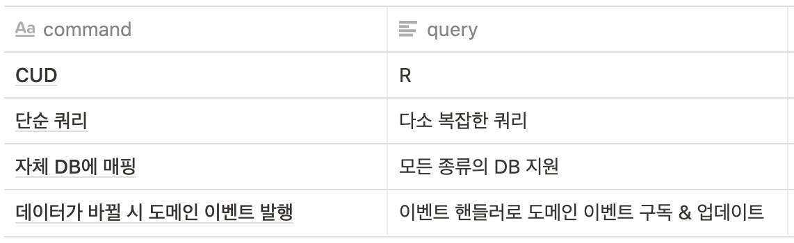
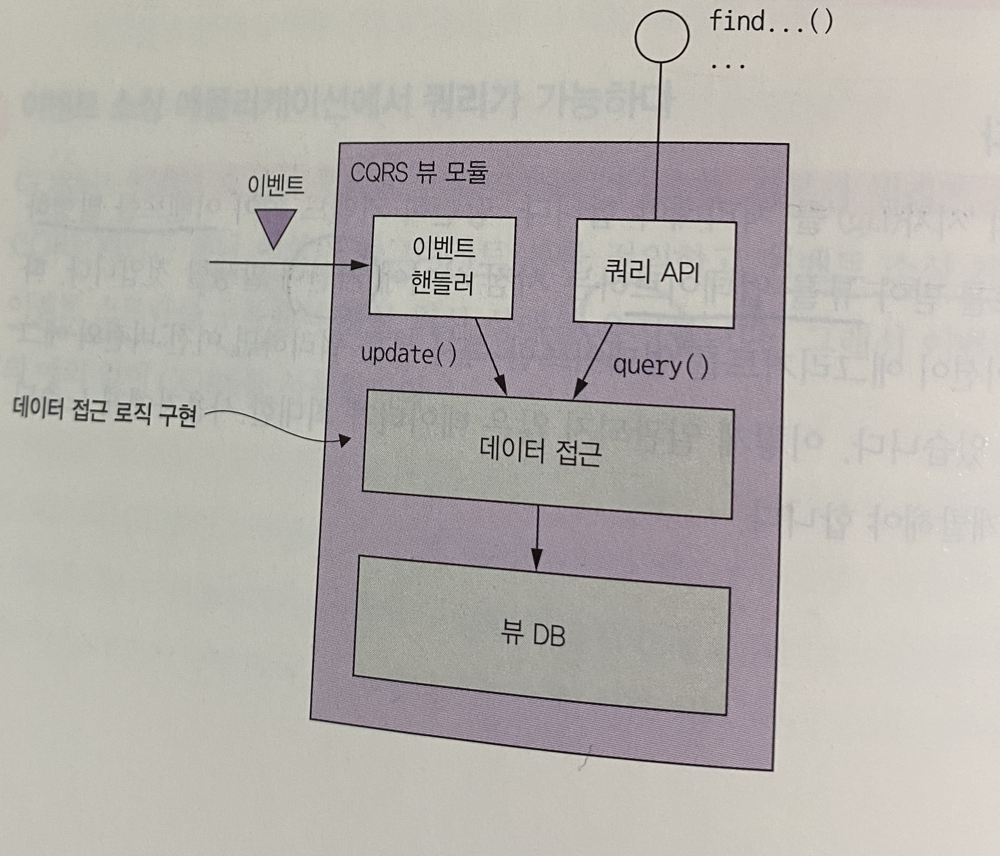

# 7장: 마이크로서비스 쿼리 구현

> 여러 서비스에 흩어져 있는 데이터를 반환하는 방법에 대해서 알아보자!

# 1. API 조합 패턴 응용 쿼리

## 🔹 개념
- 서비스 클라이언트가 데이터를 가진 여러 서비스를 **직접 호출하여 그 결과를 조합**하는 패턴
- 가장 단순하여, 기본적으로 권장함 👍

## 🔹 구조

- **API 조합기** : provider 서비스를 쿼리하여 데이터를 조회하여 조합
    1) 서비스 클라이언트
       - 단점 : 네트워크 제약 (같은 LAN 에서 가능)
    2) API 게이트웨이
    3) stand-alone 서비스
       - 외부에서 접근 가능해야 하는 경우 GOOD
       - 조합 로직이 복잡할 경우 GOOD
- **provider 서비스** : 최종 결과로 반환할 데이터의 일부를 가진 서비스

## 🔹 단점
- 여러 번 쿼리를 요청하므로 **오버헤드 증가**
- 많은 서비스가 개입되어 **가용성 저하 →** 서비스 다운에 대한 대책 필요 (ex. 캐시 데이터, 디폴트 데이터)
- 여러 DB에 여러 쿼리를 요청하여 **데이터 일관성이 결여됨**
- 효율적으로 **구현하기 어려운 쿼리**가 존재함 (ex. 빅데이터 in-memory join)

# 2. CQRS 패턴

## 🔹 개념
- 쿼리를 지원하는 하나 이상의 **뷰 전용 DB**를 유지하는 패턴
- 강력하지만, 구현은 복잡함
- API 조합 패턴의 한계 극복
    - 구현하기 힘든 다중 서비스 쿼리
        - ex) 필터의 키워드를 저장하지 않는 DB를 가진 서비스가 있는 경우
        - API 조합으로는 값비싸고 비효율적인 in-memory join 을 써야 함
    - 구현하기 힘든 단일 서비스 쿼리
        - ex) 데이터를 가진 서비스가 필요한 쿼리를 효율적으로 지원하지 않는 DB를 갖고 있어서, 그 서비스에 쿼리를 구현해서는 안 되는 경우

## 🔹 구조

- 커맨드와 쿼리를 분리
  - 

- 쿼리 전용 서비스
    - stand-alone 형태가 적합
    - 쿼리 작업만 구성된 API
    - 한 서비스가 가진 데이터를 복제한 뷰를 구현하는 수단으로도 유용

## 🔹 장/단점
- 장점
    - 여러 데이터에서 데이터를 미리 조인해놓는 CQRS 뷰로 **효율적인 쿼리** 가능
    - 다양한 뷰를 통해 **다양한 쿼리**를 효율적으로 구현
    - **이벤트 소싱 애플리케이션**에서 쿼리 가능
    - **관심사 분리** (쿼리 구현 서비스 / 데이터 소유 서비스의 분리)
- 단점
    - 아키텍처가 복잡
    - 복제 시차를 신경써야 함

## 🔹 CQRS 뷰 설계

- 뷰 모듈
    - 뷰 DB
    - 데이터 접근 모듈
    - 이벤트 핸들러
    - 쿼리 API

- 뷰 선택
    - 쿼리 작업을 효율적으로 구현하도록 뷰를 잘 선택해야 함!
    - 유연한 데이터 모델과 우수한 성능/확장성 때문에 주로 NoSQL DB가 CQRS 뷰와 잘 맞음
        - 그러나 데이터에 따라서 다름
    - 이벤트 핸들러는 뷰 DB를 업데이트할 때, 외래키 기반의 업데이트가 필요한지도 고려해야 함

- 데이터 접근 모듈 설계
    - 뷰가 여러 애그리거트의 이벤트를 구독할 때, 동시성 처리가 필요
    - 이벤트 핸들러는 멱등해야 함
    - 클라이언트는 최종 일관된 뷰를 사용해야 함
        - `커맨드`  - - - 토큰(이벤트 ID) - - -→ `클라이언트` - - - 토큰 - - -→ `쿼리`

- 뷰 추가/업데이트
    - 모듈 개발 → 데이터 저장소 세팅 → 서비스 배포
    - 메시지 브로커는 메시지를 무기한 보관할 수 없으므로, 아카이빙된 과거 이벤트를 가져와서 뷰를 구축
    - 스냅샷을 주기적으로 만들고 이후 이벤트를 불러와서 단계적으로 뷰를 생성

## 🍪 CQRS 관련 추천 영상
[[우아콘2020] 배달의민족 마이크로서비스 여행기](https://www.youtube.com/watch?v=BnS6343GTkY&t=1222s)