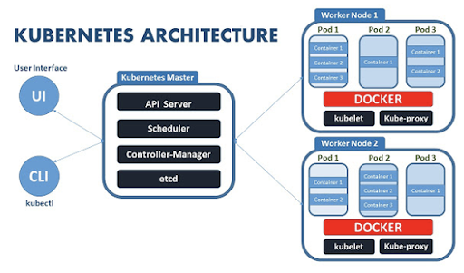

# 12장. 마이크로서비스 배포 방법(패키징, 가상머신, 컨테이너, 서버리스)

## 서비스 배포

4대 주요 배포 패턴의 작동 원리와 장단점을 비교

## 언어에 특정한 패키징 포맷 (Language Specific Packaging)

Java의 경우 전체 프로젝트를 war 파일로 만들어 Tomcat 등의 웹 컨테이너를 통해 배포

- 장점
    - 배포가 빠름
        - 네트워크를 통해 복사하는 양이 적음
        - 서비스 시동 시간도 짧음
        - 리소스를 효율적으로 활용할 수 있음
- 단점
    - 기술 스택을 캡슐화할 수 없음
        - 서비스별로 런타임 버전이 정해져 있음 (자바 웹 어플리케이션-실행 가능한 아파치 톰캣, JDK)
            - 런타임이란?
                - 소프트웨어 프로그램을 실행할 환경
                - 클래스 파일을 로드하고 메모리 및 기타 시스템 리소스에 대한 액세스를 확보
                - 예) JRE(Java Runtime Environment): 자바 프로그램을 위한 일종의 메타 운영체제 
                    - java program이 거의 모든 운영체제 위에서 수정 없이 실행될 수 있도록 함
                    - 실행에 필요한 라이브러리와 소프트웨어가 포함되고 메모리를 관리할 수 있도록 함
        - 버전 관리가 복잡해 배포 중 에러가 발생할 가능성이 있음
    - 서비스 인스턴스가 소비하는 리소스를 제한할 수 없음
        - 한 프로세스가 전체 CPU/메모리를 소모해도 제한하지 못함
    - 여러 서비스 인스턴스를 서로 격리할 수 없음
    - 서비스 인스턴스를 어디에 둘지 자동으로 결정하기 어려움

## 가상 머신

서비스를 가상 머신 이미지로 묶어 배포

가상화는 하이퍼바이저를 사용하여 하드웨어를 에뮬레이션하고 이를 통해 여러 운영 체제를 동시에 실행. 

- 장점
        - VM 이미지로 기술 스택을 캡슐화
        - 서비스 인스턴스가 격리됨
            - 정해진 CPU/메모리 리소스가 가상 머신마다 배정됨 
        - 성숙한 클라우드 인프라를 활용
- 단점
    - 리소스를 효율적으로 활용할 수 없음
        - 서비스 인스턴스마다 OS를 포함한 전체 가상 머신의 오버헤드가 있음
        - 상대적으로 무거운 자바 기반 서비스라면 크게 문제되지 않지만, 가변운 Node.js나 고 언어 서비스라면 비효율적인 배포 방식
    - 배포가 비교적 느림
        - VM 이미지는 대부분 크기가 커서 빌드 시간이 오래 걸리고 네트워크를 통해 이동하는 데이터양이 많음
    - 시스템 관리 오버헤드가 발생
        - OS/런타임 패치를 해야 함

## 컨테이너

OS 수준에서 가상화한 메커니즘

가장 유명한 컨테이너 런타임(컨테이너 실행을 담당하는 소프트웨어)은 도커

- 배포 과정

    - 서비스를 도커로 배포
        - 컨테이너 이미지:
            - 애플리캐이션과 서비스 구동에 필요한 모든 소프트웨어로 구성된 파일 시스템 이미지
    - 도커 이미지 빌드
        - 도커파일 작성: 이미지를 빌드하는 방법이 기술되어 있음
            - 기초 컨테이너 이미지(base image)를 지정하고 소프트웨어 설치 및 컨테이너 구성에 관한 커맨드를 쭉 나열한 후, 컨테이너 생성 시 실행할 셸 커맨드를 기재
    - 도커 이미지를 레지스트리에 푸시
        - 도커허브: 대표적인 퍼블릭 도커 레지스트리
        - 도커 이미지는 layered file system으로 구성되어 있어 이미지 일부(목적지에 존재하지 않는 계층)만 네트워크로 전송하면 되므로 빠름
    - 도커 컨테이너 실행
        - 컨테이너 인프라가 이미지를 레지스트리에서 프로덕션 서버로 당겨 오고, 이 이미지로부터 컨테이너를 하나 이상 생성
        - 각 컨테이너가 하나의 서비스 인스턴스
        - docker run은 하나의 머신에서 실행되는 컨테이너를 생성
        - 도커 컴포즈: 컨테이너를 YAML 파일에 선언적으로 정의할 수 있게 해주는 툴
            - 여러 컨테이너를 하나의 그룹으로 묶어 시동/중지할 수 있음
            - 단 단일 머신에 국한됨
        - 쿠버네티스: 여러 머신을 하나의 리소스 풀로 전환해주는 도커 오커스트레이션 프레임워크

- 장점
    - 기술 스택의 캡슐화
    - 컨테이너 별로 격리된 프로세스로 실행됨
    - 고유 IP 주소를 가지고 있어 포트 충돌 가능성이 없고, 컨테이너마다 자체 루트 파일 시스템을 가지고 있음
        - 자체 루트 파일 시스템? 
            - cloudrain21.com/examination-of-docker-containersize-ufs
            - 도커에서는 Union File System(UFS)를 사용
            - 여러 개의 File System을 하나로 결합하여 취급할 수 있도록 함
            - 특정 image를 이용하여 컨테이너를 기동한다는 것은 차곡차곡 쌓인 image layer를 하단에 깔아두고(Read-Only Image Layer), 최종적으로 맨 위에 Container Layer(Writable Layer)를 얹은 후, 이 모든 레이터들을 결합하여 사용자에게 하나의 File System View로 제공
    - 서비스 인스턴스의 리소스를 제한할 수 있음
    - OS 부팅을 안 해도 되므로 시동이 빠름
- 단점
    - 컨테이너 이미지를 직적 관리해야 함
    - OS와 런타임 패치를 정기적으로 해줘야 함
    - 컨테이너 인프라 및 실행 기반인 VM 인프라를 직접 관리해야 함

## VM과 Container 비교

### VM

- hypervisor가 hardware 가상화를 하고, 그 위에 Guest OS가 올라감 (Host OS 위에 Guest OS를 가상화하는 방식)
    - Hypervisor: 
        - 하나의 하드웨어에서 다수의 운영체제들을 생성할 수 있게 해주고, 하드웨어의 물리적인 리소스들(CPU, Storage, Memory)을 가상머신에게 할당
        - 종류
            - Type 1 (Native): 하드웨어 바로 위에 설치
            
                - 호스트 하드웨어에 직접 설치하여 구동
                - 하드웨어를 제어하는 OS 역할과 VM들을 관리하는 역할을 모두 담당
                - 하이퍼바이저가 하드웨어 위에 설치되면 가상머신(VM)을 생성하고 원하는 운영체제를 선택해 설치 가능
                - 메모리 오버커밋(물리적 서버에서 사용 가능한 양보다 더 많은 메모리를 할당)이 가능
                    - 가상머신에게 실제 사용 가능한 양보다 더 많이 할당해도 하이퍼바이저가 실제 필요한 만큼의 RAM만 사용하도록 관리
                - 장점
                    - 하이퍼바이저가 하드웨어의 필요한 자원을 요청할 수 있어 안정적이고 성능이 좋음(낮은 오버헤드)
                - 단점
                    - 가상머신을 생성할 때마다 가상머신의 OS에 맞게 하드웨어 드라이버를 세팅해 주어야 함
                - 제품
                    - Xen, KVM(Kernel-based Virtual Machine), ...
            - Type 2 (Bare Metal형): Host OS 위에 설치
            
                - Host OS 위에 하이퍼바이저를 설치하는 방식
                - 오버커밋 불가
                    - 사용자가 할당한 만큼의 자원을 실제로 사용
                - 제품
                    - QEMU, VirtualBox, Parallels Desktop for Mac
    - 하이퍼바이저에서 VM을 실행하려면 메모리 관리 프로그램, 프로세스 스케줄러, I/O 스택, 기기 드라이버, 보안 관리 프로그램, 네트워크 스택과 같은 운영 체제 수준의 구성 요소가 필요
        - Host machine과 다른 CPU, storage drive, NIC을 사용할 수 있음
    - 느린 이유
        - I/O가 발생하는 통로가 container보다 김
        - VM이 처리한 I/O를 결국 host os의 커널이 다시 받아 자신의 드라이버에 맞게 처리해 줘야 함

### Container

- OS의 자원인 커널을 공유하지만 어플리케이션 단위로 추상화하여 서로 격리
    - Docker Engine 위에 application 실행에 필요한 바이너리를 바로 올림
        - Hypervisor가 필요 없음
    - 커널은 호스트의 커널을 공유
- 장점
    - OS overhead가 없으니 start time도 빠르고 자원 효율성도 높음
- 단점
    - 보안에 취약: container가 host를 공유하면 container 하나가 뚫리면 바로 host 커널이 위험해짐
- 격리는 linux namespace 통해 수행
- Linux Container (LXC)

    - 하드웨어 자원들을 cgroups를 통해 할당하고 namespace를 활용하여 프로세스나 IPC 등을 격리시켜 별도의 공간을 만드는 형태

## 서버리스

- 언어에 특정한 패키징, VM으로서의 서비스, 컨테이너로서의 서비스의 한계

    - 컴퓨팅 리소스를 사전에 프로비저닝해야 함
    - 사람이 직접 시스템 관리를 해야 함
        - OS 패치
    - 물리머신: 랙킹, 스태킨
    - 언어 런타임 관리
- 단어 뜻 그대로 서버가 없다는 뜻이라기 보다는 보이지 않는 곳 어딘가에 관리형 서버가 있다는 뜻. 물리적 서버의 관리는 클라우드 사업자의 몫.
- 서버리스 컴퓨팅
    - 클라우드 사업자가 운영하는 가상화된 컨테이너에서 미리 필요한 기능을 함수의 형태로 구현해두고 이벤트 드리븐 방식으로 필요에 따라 함수를 호출해 사용. 시스템 상의 다양한 이벤트를 함수의 형태로 처리. 
- 인프라에 대한 준비와 운영 인력을 최소화해야 하는 소규모 깃술 인력에 알맞음
- pricing
    - 일반적인 클라우드 서비스: 저장소 볼륨, 트래픽 요금...
    - 서버리스: 단위 시간당 함수가 처리하는 트랜잭션의 수와 이때의 네트워크 및 메모리 사용률 기반
        - 트랜잭션이 없는 유휴 시간이 많은 서비스에 좋음
- 종류
    - AWS의 Lanbda
    - Microsoft의 Azure Functions
    - Google의 Cloud Functions

### AWS 람다를 이용한 서버리스 배포

- AWS 람다: Node.js, c#, Go, Python 지원
- 배포 방법
    - 애플리케이션을 ZIP/JAR 파일로 묶어 AWS 람다에 업로드
    - 요청할 함수명을 지정
    - AWS 람다가 들어온 요청을 처리하기에 충분한 개수만큼 마이크로서비스 인스턴스를 자동실행
- 장점
    - 다양한 AWS 서비스와의 연계
    - 시스템 관리 업무가 줄어들음: 저수준의 시스템 관리(OS, 런타임 패치)를 안 해도 됨
    - 탄력성: 부하 처리에 필요한 개수만큼 인스턴스를 실행.
    - 사용량만큼 과금
- 단점
    - long-tail latency: 지연시간이 있음
        - AWS 람다는 코드를 동적 실행해 애플리케이션 인스턴스를 프로비저닝하고 애플리케이션을 시동하기까지 시간이 걸림
    - 제한된 이벤트/요청 기반 프로그래밍 모델
        - AWS 람다는 처음부터 실행 시간이 긴 서비스를 배포할 용도가 아님

## 쿠버네티스를 이용한 서비스 배포

- 쿠버네티스: 도커 오케스트레이션 프레임워크
- 도커가 실행되는 여러 머신을 하나의 리소스 풀로 취급
    - 리소스 관리: 여러 머신을 CPU, 메모리, 스토리지 볼륨을 묶어 놓은 하나의 리소스 풀로 취급
    - 스케줄링: 컨테이너를 실행할 머신을 선택
        - 요청 부하를 인스턴스에 고루 분산
    - 서비스 관리: 서비스를 명명하고 버저닝함
- 항상 서비스 인스턴스별 개수를 원하는 만큼 실행되도록 유지할 수 있음
- 개념
    - 파드: 쿠버네티스의 기본 배포 단위 
    - 디플로이멘트: 파드 인스턴스를 원하는 개수만큼 실행시키는 컨트롤러. 롤링 업데이트/롤백 기능이 탑재됨
        - 보통 YAML 파일로 정의
        - 롤링 업데이트: 무중단 배포
            - 파드마다 신 버전이 요청 처리 준비가 완료되기 전에는 구 버전을 절대 중지하지 않음
        - 롤백: 롤아웃이라는 이력을 통해 쉽게 이전 버전으로 되돌릴 수 있음
    - 서비스: 클라이언트에 안정된 정적 네트워크 위치를 제공. 서비스는 자신의 IP 주소로 향하는 트래픽 부하를 여러 파드에 고루 분산 (IP 주소, DNS 명은 오직 쿠버네티스 내부에서만 접근 가능).
    - API 게이트웨이: 외부 세계에서 서비스로 향하는 트래픽 라우팅,
    - 컨피그맵: 컨테이너 내부 구성 파일.

## 서비스 메시를 이용한 배포와 릴리스를 구분

- 배포: 운영 환경에서 실행
- 서비스 릴리스: 최종 사용자에게 서비스를 제공
- 배포 단계
    - 최종 사용자 요청을 서비스에 라우팅하지 않고 새 버전의 서비스를 프로덕션에 배포
    - 프로덕션에서 새 버전을 테스트
    - 소수의 최종 사용자에게 새 버전을 릴리스
    - 모든 운영 트래픽을 소화할 때까지 점점 더 많은 사용자에게 새 버전을 릴리스
    - 어딘가 문제가 생기면 곧장 구 버전으로 되돌림. 새 버전이 정확히 잘 동작한다는 확신이 들면 구 버전을 삭제
- 서비스 메시
    - 한 서비스와 다른 서비스, 외부 애플리케이션의 모든 통신을 중재하는 네트워킹 인프라
    - 규칙 기반의 부하 분산 및 트래픽 라우팅 기능을 제공 => 여러 버전의 서비스를 동시에 실행할 수 있음
- 이스티오 서비스 메시
    - 마이크로서비스를 연결, 관리, 보안하는 오픈 플랫폼
    - 모든 서비스 네트워크 트래픽이 통과하는 네트워크 계층

### 참조

크리스 리처드슨 저, 이일웅 번역, 마이크로 서비스 패턴,도서출판 길벗, 2020.1.30.

www.itworld.co.kr/news/110768

"JRE란 무엇인가", 자바 런타임 환경의 이해 - ITWorld Korea
자바 개발 키트(Java Development Kit, JDK), 자바 가상 머신(Java Virtual Machine, JVM), 자바 런타임 환경(Java Runtime Environment, JRE)은 자바 애플리케이션을 개발하고 실행하기 위한 자바 플랫폼의 3대 구성 요소
www.itworld.co.kr
www.redhat.com/ko/topics/containers/whats-a-linux-container

리눅스 컨테이너(Linux Container): 개념, 종류, 장점, 설치
리눅스 컨테이너(Linux Container)란 시스템에서 격리된 프로세스로, 필요한 파일을 제공하는 이미지에서 실행됩니다. 개념, 이점, 기술, 종류, 설치를 쉽게 설명합니다.
www.redhat.com
brunch.co.kr/@sangjinkang/12

09화 서버리스 컴퓨팅이란 무엇인가?
자동화된 인프라 운영으로, 빠른 개발을 돕는 서버리스 컴퓨팅 | 가트너(Gartner)의 최근 발표에 따르면, 인프라 조직은 데이터 센터, 코로케이션, 클라우드와 같은 기존 지식을 뛰어넘어, 인프라
brunch.co.kr
Docker와 VM. Docker를 공부하면 가장 처음 등장하는 내용이 바로 `docker… | by 서강혁 | Medium

하이퍼바이저(Hypervisor)의 종류 - Rain.i (cloudrain21.com)

클라우드이해하기 2: 하이퍼바이저와 가상화(1). 클라우드 서비스의 등장으로 사용자들은 언제 어디서든 인터넷만 된다면… | by 이찬호 | Medium